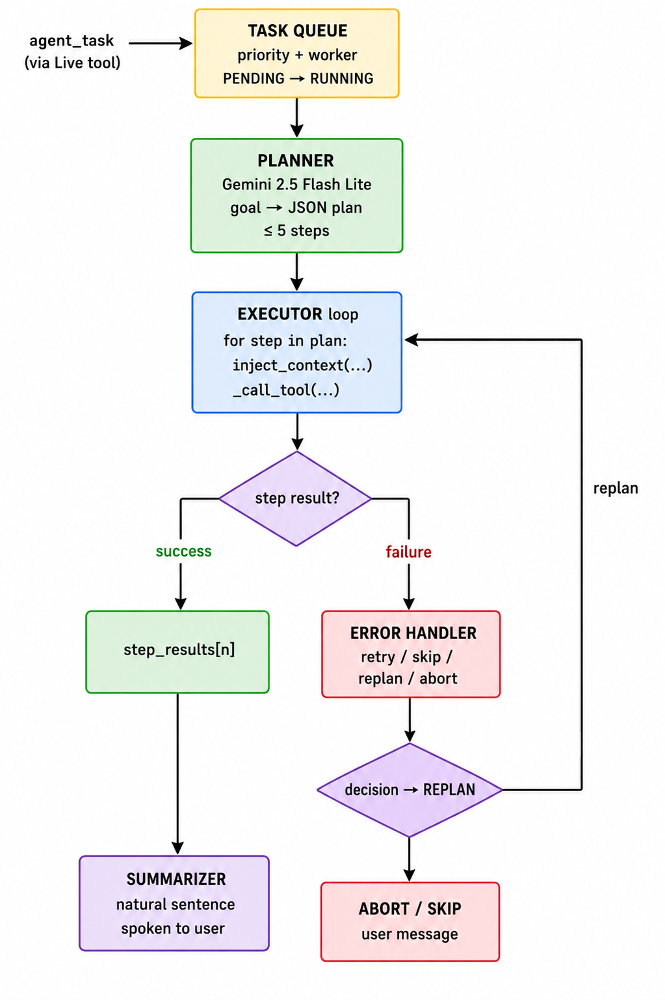

# 3.1 Block Diagram

The block diagram is the highest-level architectural drawing of R.A.Y.A v2.4. It shows **which logical components exist**, **how they are grouped into layers**, and **which arrows of communication connect them**. Lower-level data flow and call sequencing is covered in Section 3.3 (System Workflow and Data Flow).

The full system is best understood as **six concentric layers** wrapped around a single Gemini Live session.

---

## 3.1.1 High-Level Block Diagram

```
┌─────────────────────────────────────────────────────────────────┐
│  EXTERNAL ENV — User · Mic · Speakers · Screen · OS · Internet  │
└────────────────────────────────┬────────────────────────────────┘
                                 ▲
                                 ▼
              ┌─────────────────────────────────┐
              │ LAYER 1 · UI  (ui.py / RayaUI)  │
              └─────────────────┬───────────────┘
                                ▲
                                ▼
              ┌─────────────────────────────────┐
              │ LAYER 2 · ORCHESTRATION         │◄─────┐ delegates
              │ main.py · RayaLive · dispatcher │      │ complex
              └────┬──────────────────────┬─────┘      │ goals
                   ▲                      │            │
                   ▼                      ▼            │
       ┌──────────────────┐    ┌─────────────────────┐ │
       │ LAYER 3 · LIVE   │    │ LAYER 5 · ACTIONS   │ │
       │  google-genai    │    │ 17 tool modules     │ │
       │  streaming + TC  │    │ open_app, browser…  │ │
       └────────┬─────────┘    └─────────────────────┘ │
                ▼                          ▲           │
       ┌──────────────────┐                │           │
       │  GEMINI MODELS   │       ┌────────┴───────────┴┐
       │  Live · Flash    │       │ LAYER 6 · AGENT     │
       │  Lite · Vision   │       │ queue · plan · exec │
       └──────────────────┘       │       · err_handler │
                                  └─────────────────────┘

┌─────────────────────────────────────────────────────────────────┐
│ LAYER 4 · STATE — memory/long_term.json · config/api_keys.json  │
└─────────────────────────────────────────────────────────────────┘
```

*Compact six-layer view. The per-layer breakdown — including the full list of 17 action modules and the internals of each block — is given in Section 3.1.2 immediately below.*

The dashed connections in the diagram represent the *runtime arrows* between layers. They are colour-coded in the original drawing — but in this monochrome text rendering, the role of each arrow is documented in 3.1.4 below.

---

## 3.1.2 Layer-by-Layer Description

### Layer 1 — UI Layer (`ui.py` → `RayaUI`)

The presentation surface. A Tkinter application that runs on the main thread of the process. Responsibilities:

- Render the **animated face** in three visual states (LISTENING, THINKING, SPEAKING) and a dedicated MUTED state.
- Display the **activity log** of user/assistant utterances and tool calls.
- Display the **task queue snapshot** showing pending and running agent tasks.
- Accept **text input** as an alternative to voice.
- Toggle **mute** via F4 or button.
- On first launch, prompt the user for the **Gemini API key** and write it to `config/api_keys.json`.

### Layer 2 — Orchestration (`main.py` → `RayaLive`)

The central nervous system. Owns the Gemini Live session, registers all 20 tool declarations, and dispatches `tool_call` events to either an `actions/` module (for single-step tools) or the agent subsystem (for `agent_task`).

Responsibilities:

- Build the `LiveConnectConfig` with the loaded memory and system prompt.
- Run four concurrent asyncio tasks (`_send_realtime`, `_listen_audio`, `_receive_audio`, `_play_audio`).
- Maintain the `_is_speaking` lock so the microphone is gated while R.A.Y.A speaks.
- Catch transport errors and auto-reconnect after a 3-second backoff.
- Route every `tool_call` through a single dispatcher (`_execute_tool`).

### Layer 3 — Live API Client (`google-genai` library)

A thin layer R.A.Y.A does not own but heavily depends on. Provides:

- WebSocket-style streaming.
- Server-side voice-activity detection.
- Native audio in/out at 16 kHz / 24 kHz.
- Tool-calling protocol with structured `tool_call` and `tool_response` messages.
- Session resumption when the network blips.

### Layer 4 — State & Persistence (`memory/`, `config/`)

The disk-backed state. Two files matter:

- **`memory/long_term.json`** — the six-category personalization store, capped at 2200 characters and trimmed by `_trim_to_limit`.
- **`config/api_keys.json`** — the user's Gemini API key.

The `memory_manager.py` module exposes `load_memory`, `update_memory`, and `format_memory_for_prompt`, which is called at every session start to inject the user's known facts into the system instruction.

### Layer 5 — Actions Layer (`actions/`)

17 standalone Python modules, one per tool category. Each module exposes a single top-level function (`open_app`, `browser_control`, `file_controller`, …) with a uniform signature `(parameters, player=None, response=None, **kwargs) -> str`. The functions are written to be **independently usable** — they can be called directly from the agent executor or from the Live dispatcher with no setup.

Two of these actions are themselves mini-pipelines:

- **`screen_processor.py`** — captures the display or webcam, calls Gemini Vision with the user's question, and speaks the answer directly through the UI player.
- **`dev_agent.py`** — generates a multi-file project, writes the files to disk, installs dependencies, opens VS Code, runs the entry point, and self-fixes errors.

### Layer 6 — Agent Subsystem (`agent/`)

The autonomous-task brain. Four modules:

- **`task_queue.py`** — priority queue + worker thread + status tracking.
- **`planner.py`** — converts a goal into a JSON plan via `gemini-2.5-flash-lite`.
- **`executor.py`** — runs the plan step by step, with retries, replan, and inter-step content injection.
- **`error_handler.py`** — classifies failures into RETRY / SKIP / REPLAN / ABORT decisions.

---

## 3.1.3 Subsystem Block Diagram — Agent Loop

A zoom-in on Layer 6, which is the most algorithmically rich part of the system:



*Figure 3.1.3 — Zoom-in on the agent subsystem (Layer 6). A goal entering through the `agent_task` tool is queued by the **TASK QUEUE** (priority + worker, PENDING → RUNNING), passed to the **PLANNER** (Gemini 2.5 Flash Lite) which produces a JSON plan of up to 5 steps, then handed to the **EXECUTOR loop** which iterates `inject_context(...)` and `_call_tool(...)` for each step. On success the step result is accumulated into `step_results[n]` and the loop continues until the **SUMMARIZER** speaks a natural-sentence wrap-up to the user. On failure the **ERROR HANDLER** chooses one of four decisions — retry / skip / replan / abort — and a REPLAN decision loops back into the executor with a revised plan.*

Three loops are visible in this diagram:

1. **Inner retry loop** (`while attempt <= 3` in `executor.py`) — handles transient failures.
2. **Replan loop** (`while True` + `MAX_REPLAN_ATTEMPTS = 2`) — handles non-recoverable step failures by regenerating the remaining plan.
3. **Worker loop** (`_worker_loop` in `task_queue.py`) — pulls the next task from the priority queue and spawns it on its own thread.

---

## 3.1.4 Arrow Inventory — What Flows Between Blocks

| # | From | To | What flows | When |
|---|---|---|---|---|
| A1 | User mic | UI | Audio frames | Always (unless muted) |
| A2 | UI | Orchestration | Audio frames → outbound queue | Every callback |
| A3 | Orchestration | Live API | PCM stream, text turns | Continuous |
| A4 | Live API | Orchestration | Audio chunks, transcripts, `tool_call` | Continuous |
| A5 | Orchestration | UI | Speaker audio | While speaking |
| A6 | Orchestration | Actions | `(name, args)` → action function | On each `tool_call` |
| A7 | Actions | Orchestration | Return string | After execution |
| A8 | Orchestration | Agent | `agent_task` goal | When user requests multi-step task |
| A9 | Agent | Actions | Step tool + parameters | For every plan step |
| A10 | Actions | Agent | Step result | After each step |
| A11 | Agent | Orchestration | Final summary | When plan completes |
| A12 | Orchestration | Memory | `update_memory(...)` | On `save_memory` call |
| A13 | Memory | Orchestration | `format_memory_for_prompt()` | At every session start |
| A14 | Orchestration | UI | Activity / queue snapshot / state | Continuous |
| A15 | Live API | Gemini Cloud | Audio + text + tool decls | Continuous |
| A16 | Actions | OS / Internet | App launches, file ops, browser, etc. | On demand |
| A17 | Vision (Action) | Gemini Vision | Image + question | On `screen_process` |
| A18 | Vision (Action) | UI | Spoken answer | After vision call |

The 18 arrows above are the complete communication graph of R.A.Y.A v2.4. Every code path in the project traces along one of these arrows.

---

## 3.1.5 Threading and Process Topology

The block diagram is logical; the physical execution topology is also worth documenting. R.A.Y.A runs in a **single Python process** with the following threads:

```
Process: python main.py  (or RAYA.exe)
│
├── Thread 0  — Tkinter main thread  (ui.py, root.mainloop)
│
├── Thread 1  — RayaLive runner      (daemon thread, runs asyncio loop)
│      └── asyncio TaskGroup
│           ├── _send_realtime         (outbound audio + text)
│           ├── _listen_audio          (microphone → out_queue)
│           ├── _receive_audio         (server events → dispatcher)
│           └── _play_audio            (audio_in_queue → speakers)
│
├── Thread 2  — sounddevice callback (driven by PortAudio backend)
│
├── Thread 3  — TaskQueue worker     (agent/task_queue.py::_worker_loop)
│      └── per-task threads          ( _run_task spawns one per task )
│
└── Thread N  — Executor pool        (loop.run_in_executor for tool calls)
```

The diagram makes explicit why R.A.Y.A is a **hybrid concurrency model**: asyncio for streaming I/O, threads for blocking tool calls and the Tkinter UI, and the TaskGroup as the cooperative orchestration boundary.

---

## 3.1.6 Process-Boundary Diagram

For installer builds, the block diagram crosses one process boundary — the bundled Playwright Chromium subprocess:

```
RAYA.exe  (PyInstaller bundle)
  │
  ├── Python runtime + all dependencies
  ├── memory/long_term.json
  ├── config/api_keys.json
  ├── core/prompt.txt
  └── ms-playwright/   (bundled Chromium)
         └── chrome.exe   (spawned by Playwright when browser_control is invoked)
```

The `PLAYWRIGHT_BROWSERS_PATH` environment variable is set at startup by `_configure_playwright_browser_path` so that Playwright finds the bundled Chromium even when no system browser is installed.

---

## 3.1.7 Why This Layering?

A few design observations about the diagram:

- **The UI knows nothing about Gemini**, the Actions, or the Agent. It only exposes setters (`set_state`, `push_activity`, `set_queue_snapshot`, …) and getters (`muted`, `on_text_command`). This makes the UI swappable — a future Qt or web frontend could plug in without changing the orchestrator.
- **The Orchestrator is the only module that knows about all tools.** The Actions do not know about each other; the Agent does not know about the Live session. This minimizes inter-module coupling.
- **The Agent reuses Layer 5.** The executor's `_call_tool` dispatches to the *same* `actions/*.py` modules that the Live tool dispatcher uses. There is exactly one implementation of `web_search`, one of `file_controller`, etc.
- **State lives only in Layer 4.** No tool, no agent step, no UI element holds persistent state across sessions. Everything resumable is in `memory/long_term.json`.

---

## Summary

R.A.Y.A v2.4 is a six-layer architecture with a single orchestrator (`RayaLive`) at the centre, a streaming Gemini Live session as its backbone, 17 specialized action modules around it, an autonomous agent subsystem as a sibling, persistent JSON state below it, and a Tkinter UI above it. Eighteen arrows of communication connect these layers, and three concurrent control loops (retry, replan, worker) govern its agent behavior. This high-level view is the foundation for the import inventory in Section 3.2 and the runtime walkthrough in Section 3.3.
