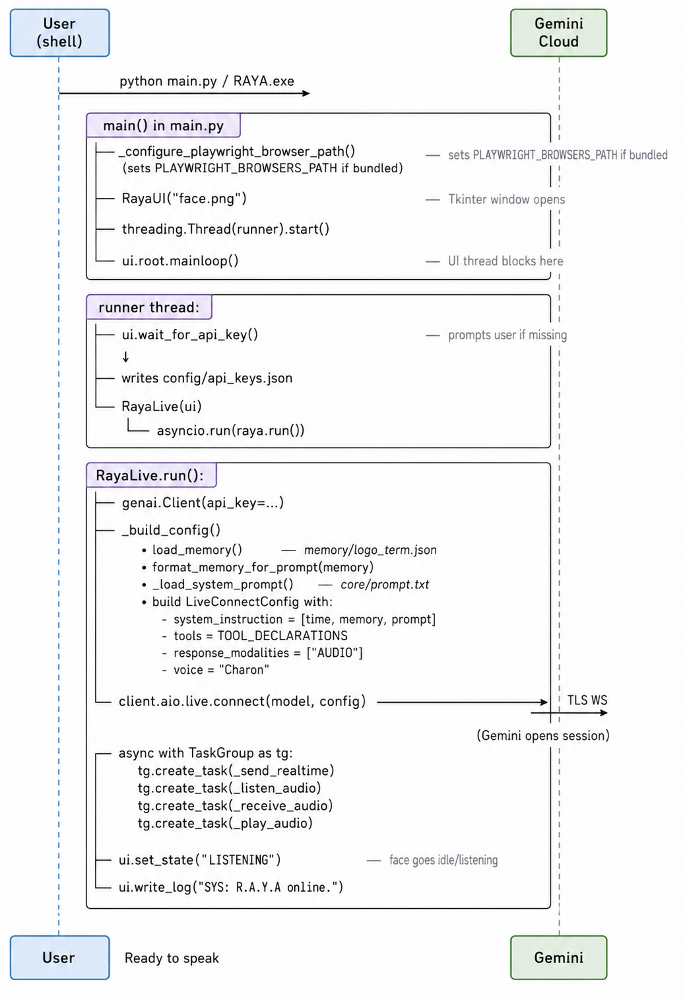
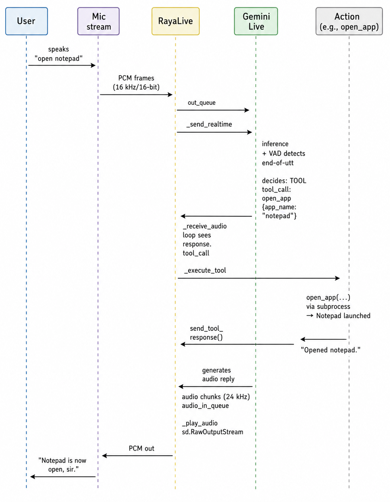
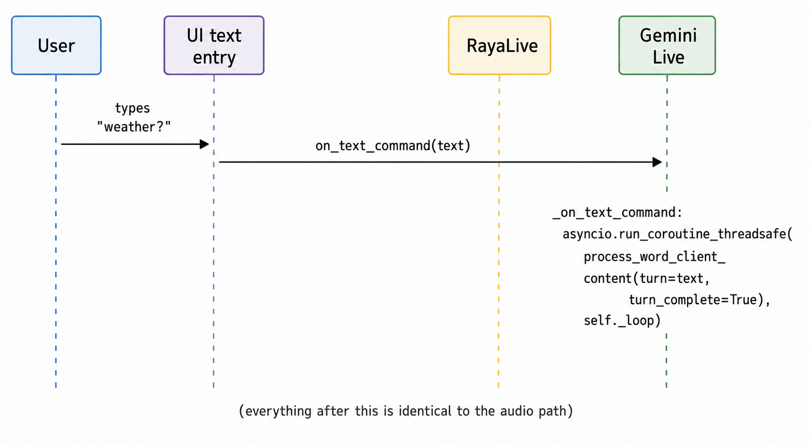
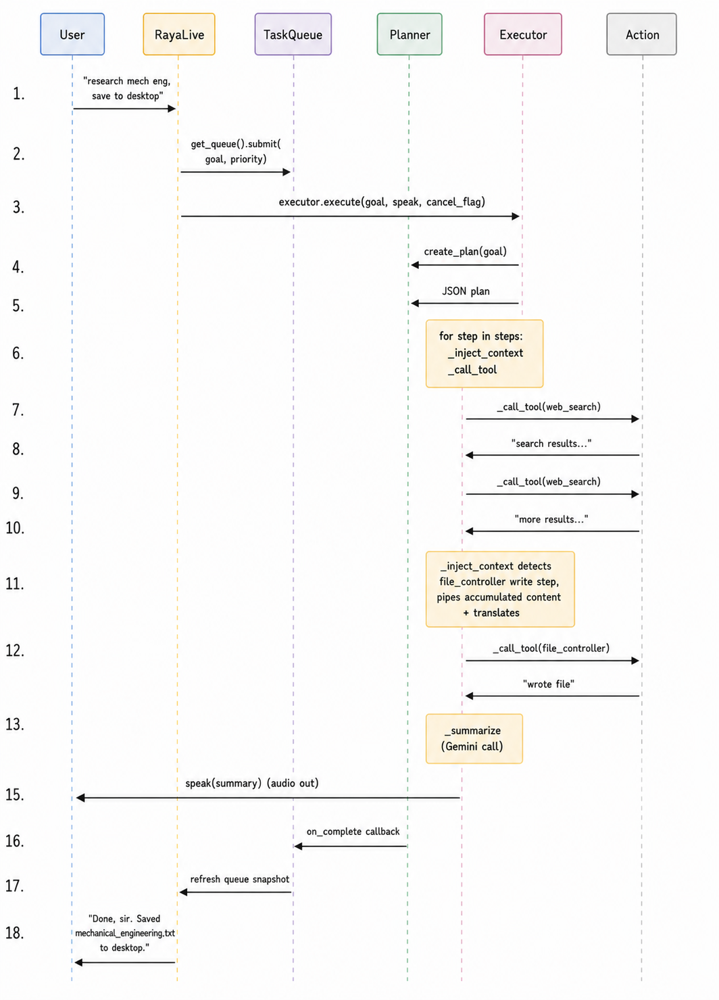
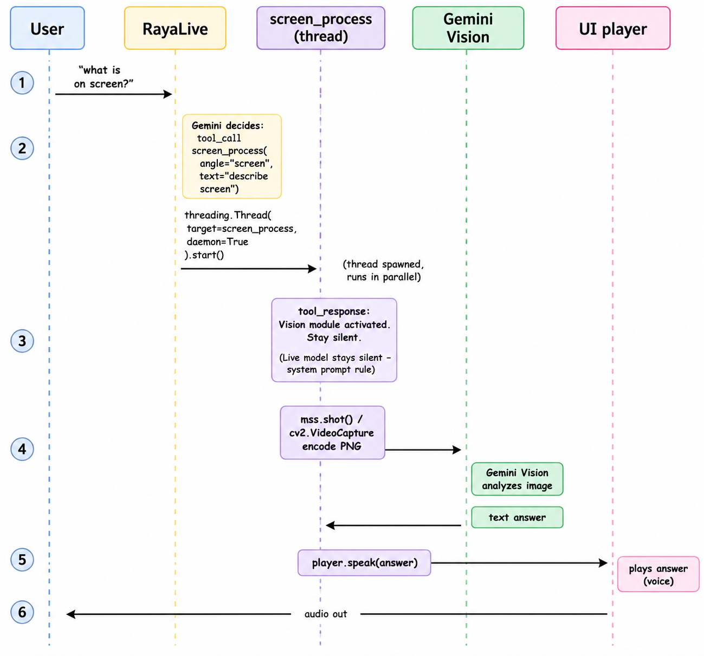

# 3.3 System Workflow and Data Flow

The block diagram in Section 3.1 shows **what** the components are; this section shows **how data moves through them at runtime**. Three perspectives are presented:

1. **Boot Workflow** — what happens from `python main.py` to "system ready".
2. **Single-Turn Conversation Flow** — what happens when the user says one sentence.
3. **Multi-Step Agent Flow** — what happens when the user issues a complex goal that triggers `agent_task`.

Each main perspective is presented as a sequence diagram (rendered image), then explained step by step with explicit references to functions in the codebase. Smaller sub-workflows later in this section are rendered as inline ASCII diagrams.

---

## 3.3.1 Boot Workflow



*Figure 3.3.1 — Sequence diagram of the R.A.Y.A boot path, from `python main.py` to a ready `LISTENING` state. The User (shell) launches the process; the Tkinter UI is constructed on the main thread; a runner thread loads memory, builds the `LiveConnectConfig`, and opens the Gemini Live session; on success the UI transitions to LISTENING.*

### Boot-step explanations

1. **`_configure_playwright_browser_path`** — if running from a frozen bundle and `ms-playwright/` exists next to the executable, sets the environment variable so Playwright finds the bundled Chromium instead of trying to download one.
2. **`RayaUI(...)`** — instantiates the Tkinter UI on the main thread. The face image is loaded, colour palette is initialized, and the window is centered on the screen.
3. **Runner thread** — a daemon thread is spawned so the asyncio event loop has its own thread; the main thread can stay responsive for Tkinter.
4. **`wait_for_api_key`** — if `config/api_keys.json` does not exist, the UI shows a first-run dialog asking the user to paste their Gemini API key.
5. **`_build_config`** — assembles the system instruction by concatenating (a) the current date/time, (b) the formatted memory block, (c) the core prompt. Registers all 20 tools as `function_declarations`.
6. **`client.aio.live.connect`** — opens the streaming session. Returns an async context manager.
7. **`TaskGroup`** — Python 3.11's structured concurrency primitive. The four tasks run cooperatively and any unhandled exception cancels the others, which forces the outer `while True` loop to reconnect.

After boot, the system enters a steady-state **LISTENING** state and waits for user input.

---

## 3.3.2 Single-Turn Conversation Flow

The most common operation: the user speaks one sentence and R.A.Y.A responds, optionally calling one tool.



*Figure 3.3.2 — Single-turn voice conversation. The microphone stream pushes PCM frames into the outbound queue, Gemini Live performs server-side VAD and emits a `tool_call`, `RayaLive._execute_tool` dispatches to the matching action module (e.g. `open_app`), the tool's return string flows back as a `tool_response`, and Gemini streams synthesized audio back through `audio_in_queue` to the speakers.*

### Step-by-step (single turn)

1. **Capture.** The sounddevice callback `_listen_audio.callback` receives an `indata` buffer every ~64 ms. If `_is_speaking` is `False` and `ui.muted` is `False`, the buffer is enqueued onto `out_queue` via `loop.call_soon_threadsafe`.
2. **Send.** `_send_realtime` continuously pulls from `out_queue` and calls `session.send_realtime_input(media=msg)`. The Gemini server performs server-side VAD and decides when the user has finished speaking.
3. **Decide.** The model decides to call `open_app`. It emits a `response.tool_call` event with the function name and arguments.
4. **Dispatch.** `_receive_audio` sees `response.tool_call.function_calls` and iterates over each `fc`, calling `await self._execute_tool(fc)`.
5. **Execute.** The dispatcher matches `fc.name == "open_app"`, runs `actions.open_app.open_app(...)` inside `loop.run_in_executor` (so the audio loop is never blocked), and gets a return string.
6. **UI update.** Throughout the execution, the dispatcher calls:
   - `ui.set_state("THINKING")` at the start.
   - `ui.push_activity("open_app", "running")`.
   - `ui.set_active_task("open_app")`.
   - After completion: `ui.push_activity("open_app", "done")`, `ui.set_last_task_result(...)`, `ui.set_state("LISTENING")`.
7. **Report back.** `session.send_tool_response(function_responses=[fr])` sends the tool's return string back to Gemini.
8. **Speak.** Gemini generates an audio acknowledgment ("Notepad is now open, sir."). The audio is streamed back as `response.data` chunks placed into `audio_in_queue`.
9. **Play.** `_play_audio` pulls from `audio_in_queue` and writes to `sd.RawOutputStream`. While audio is flowing, `set_speaking(True)` gates the microphone callback. When the turn-done event fires and the queue is drained, `set_speaking(False)` re-opens the microphone.

The end-to-end latency target for this flow is **< 1.5 s** from end-of-utterance to start-of-audio.

---

## 3.3.3 Bimodal — Text-Input Variant of a Single Turn

If the user types instead of speaking, only the first two steps change:



*Figure 3.3.3 — Text-input variant. The UI's text entry calls `on_text_command(text)`, which routes through `RayaLive._on_text_command` and then `session.send_client_content` — the same channel that converted-speech turns use. Everything after the send is identical to the audio path in Figure 3.3.2.*

Two functions of `RayaLive` are used:

- **`speak(text)`** — sends text from R.A.Y.A *to* itself (used by some tools to inject context after they finish).
- **`_on_text_command(text)`** — sends text from the user to Gemini (bound to the UI's `on_text_command` callback).

Both ultimately funnel through `session.send_client_content`, so the conversation history Gemini sees is unified across text and voice.

---

## 3.3.4 Multi-Step Agent Workflow

Triggered when the user issues a complex goal and the live model decides to call `agent_task`.



*Figure 3.3.4 — Multi-step agent workflow. Gemini Live routes the complex goal to `agent_task`, which submits it to the `TaskQueue`. A worker thread pulls the task and calls `executor.execute(...)`, which delegates plan construction to the Planner LLM, then iterates over each step — invoking the matching action module (web_search, file_controller, …) and feeding results back into subsequent steps via `_inject_context`. The final `_summarize` step generates a natural-language summary that is spoken back to the user.*

### Loop counters and bounds

The agent flow respects three explicit bounds set in code:

| Bound | Value | Location |
|---|---|---|
| Plan steps | ≤ 5 | `PLANNER_PROMPT` in `agent/planner.py` |
| Retries per step | ≤ 3 | `attempt <= 3` loop in `executor.py` |
| Replan attempts per goal | ≤ 2 | `MAX_REPLAN_ATTEMPTS = 2` in `executor.py` |

If any of these limits is exceeded, the executor aborts the goal and the user is informed via `speak`. This is the **defensive bound** referenced in Section 2.3 — preventing the runaway behavior that plagued AutoGPT-style agents.

### Inter-step content injection

The most important subtlety in this flow is `_inject_context` in `executor.py`:

```python
if tool == "file_controller" and params.get("action") in ("write", "create_file"):
    content = params.get("content", "")
    if not content or len(content) < 50:
        all_results = [
            v for v in step_results.values()
            if v and len(v) > 100 and v not in ("Done.", "Completed.")
        ]
        if all_results:
            combined = "\n\n---\n\n".join(all_results)
            translated = _translate_to_goal_language(combined, goal)
            params["content"] = translated
```

This makes the planner-executor architecture **practically useful**: the planner doesn't have to know what the search will return, and the executor automatically wires the outputs of earlier steps into the inputs of later ones whenever the schema permits. Without this, the agent would either need full-blown variable references (a major complication) or would routinely produce empty files.

### Translation in the loop

When the user's original goal is in Turkish/Hindi/Spanish/etc., the executor calls `_detect_language(goal)` and then `_translate_to_goal_language(content, goal)` to ensure the saved file is in the user's language. This step is invisible to the user — they simply see a file in their own language, which is the expected behavior of any well-designed assistant.

---

## 3.3.5 Vision-Tool Sub-Workflow

The `screen_process` tool has its own micro-workflow that runs **alongside** the main Live session rather than blocking it:



*Figure 3.3.5 — Vision-tool sub-workflow. The main Gemini Live session (not shown as a lane) dispatches `screen_process` and immediately receives the placeholder response `"Vision module activated. Stay silent…"`. A daemon thread runs in parallel: it captures the screen via `mss.shot()` or the webcam via `cv2.VideoCapture`, encodes the frame as PNG, uploads it to Gemini Vision with the user's question, receives a text answer, and pushes that answer to the `UI player` via `player.speak(answer)`. The user hears the answer through the same audio device that the main session uses — but the main session itself stays silent throughout, by system-prompt rule.*

The key trick is the **silence convention**: the Live model is instructed (in the tool's description and in `core/prompt.txt`) to stop talking after invoking `screen_process`. This prevents the main voice and the vision voice from overlapping.

---

## 3.3.6 Memory Update Sub-Workflow

The silent `save_memory` tool also has a tight micro-flow:

```
User: "I'm a third-year CSE student at SRM."
   │
   ▼
Gemini decides to call save_memory(
    category="identity",
    key="school",
    value="SRM (3rd-year CSE)"
)
   │
   ▼
RayaLive._execute_tool sees name == "save_memory":
   • update_memory({"identity": {"school": {"value": "SRM (3rd-year CSE)"}}})
   • returns {"result": "ok", "silent": True}
   • does NOT speak any acknowledgment
   • next session boot will inject this fact into the system prompt
```

The user perceives this as the assistant simply "knowing" them next time — there is no breaking of conversational flow.

---

## 3.3.7 Auto-Reconnect Flow

R.A.Y.A is designed to survive transient transport errors. The outer `while True` in `RayaLive.run` re-enters the connection block on any exception:

```
Try:
  connect ─► run 4 tasks (TaskGroup) ─► (forever)
Catch:
  print exception
  ui.push_activity("session", "failed")
  ui.set_system_notice("Connection issue: ...")
Finally:
  set_speaking(False)
  ui.set_state("THINKING")
  await asyncio.sleep(3)
  ─► back to Try
```

No state is lost across reconnects because:

- Memory lives on disk (`long_term.json`) — reloaded by `_build_config`.
- API key lives on disk (`api_keys.json`) — reloaded by `_get_api_key`.
- The system prompt and tool declarations are constants in the source code.
- Active agent tasks continue on their own threads in `task_queue.py`, unaffected by the Live disconnect.

---

## 3.3.8 Cancellation Flow (Agent Task)

A user can cancel a running multi-step task by ID (UI button or voice command routed through a future cancel tool):

```
user → ui → task_queue.cancel(task_id)
                │
                ▼
            task.cancel_flag.set()
                │
                ▼
   Executor loop checks `cancel_flag.is_set()` between steps
                │
                ▼
            speaks "Task cancelled, sir."
            returns "Task cancelled."
                │
                ▼
   on_update callback → UI clears the running indicator
```

The cancel is **cooperative**: a step in progress runs to completion, but no further steps are started. This is safer than thread-level termination (which could leave the OS in a half-consistent state — e.g., a half-written file).

---

## 3.3.9 Data Flow Summary

The full data-flow inventory of R.A.Y.A v2.4 can be summarized in one table:

| Data type | Source | Destination | Channel |
|---|---|---|---|
| User voice | Microphone | Gemini Live | `out_queue` → `send_realtime_input` |
| User text | UI entry | Gemini Live | `session.send_client_content` |
| Assistant voice | Gemini Live | Speakers | `audio_in_queue` → `RawOutputStream` |
| Transcripts | Gemini Live | UI log | `_clean_transcript` → `ui.write_log` |
| Tool calls | Gemini Live | `_execute_tool` | `response.tool_call.function_calls` |
| Tool results | Action functions | Gemini Live | `session.send_tool_response` |
| Agent goal | `_execute_tool` | TaskQueue | `queue.submit(goal=...)` |
| Plan | Planner LLM | Executor | JSON return |
| Step output | Action | Executor | `step_results[n]` |
| Final summary | Executor | UI/Speakers | `speak(summary)` |
| Memory | `memory/long_term.json` | System prompt | `format_memory_for_prompt` |
| Memory update | `save_memory` tool | Disk | `update_memory` |
| Vision frame | `mss`/OpenCV | Gemini Vision | inline PNG |
| Vision answer | Gemini Vision | Speakers | `ui.speak` |
| Activity events | All tools | UI | `ui.push_activity` |
| Task queue state | TaskQueue | UI | `ui.set_queue_snapshot` |

Every byte that moves through R.A.Y.A v2.4 corresponds to one row of this table — there is no data plane outside it.

---

## Summary

R.A.Y.A v2.4's runtime behavior is captured by three primary workflows (boot, single-turn, multi-step agent) and three sub-workflows (vision, memory update, reconnect). The block diagram shows where things sit; this section shows how they move. Together with the import inventory in Section 3.2, the methodology is now fully specified — and Section 4 can drill into the actual code, file by file.
