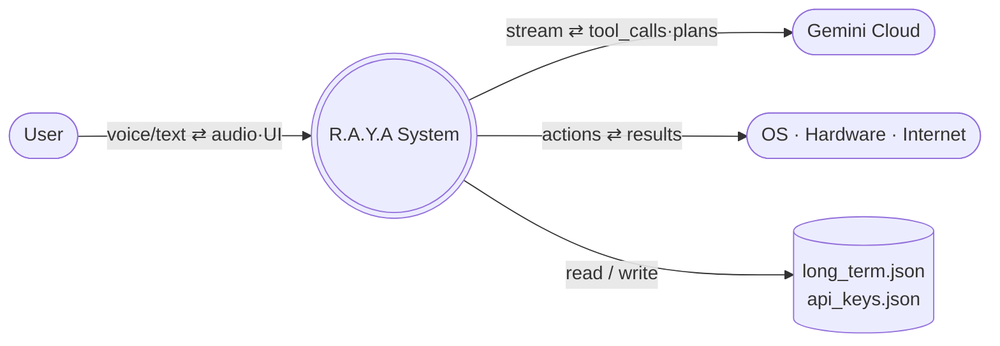
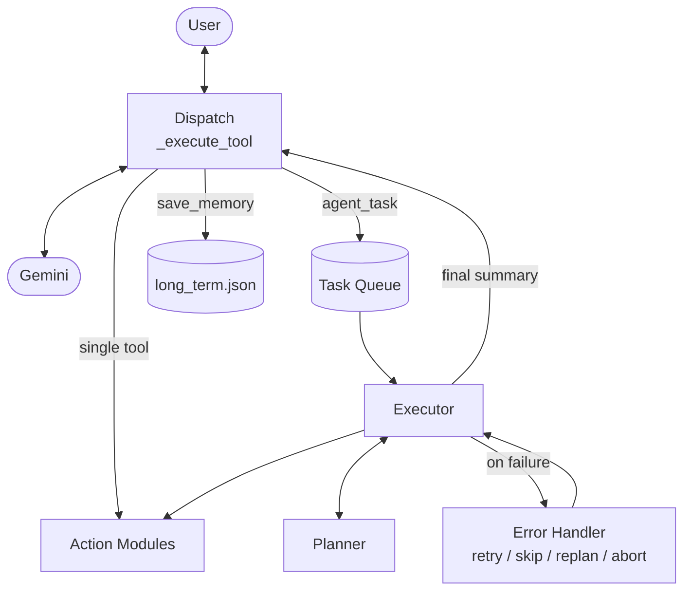
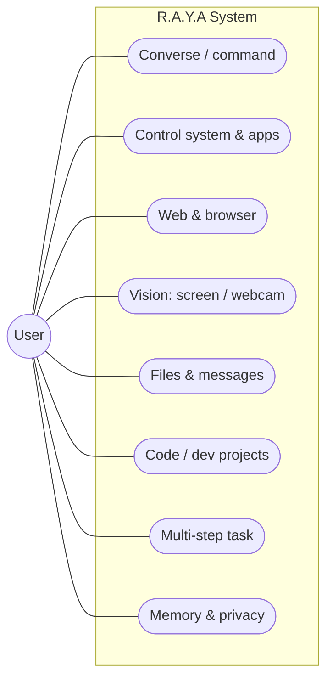
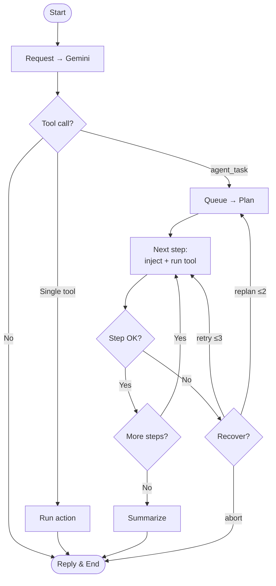
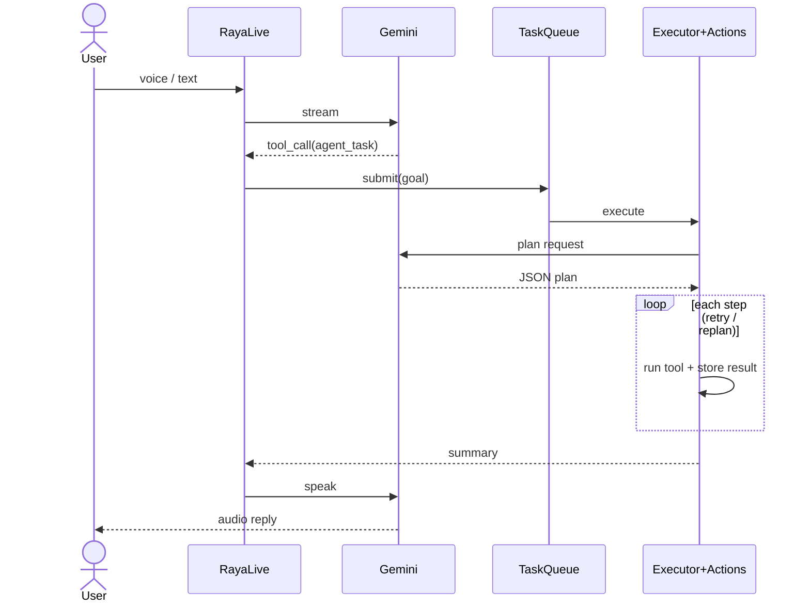
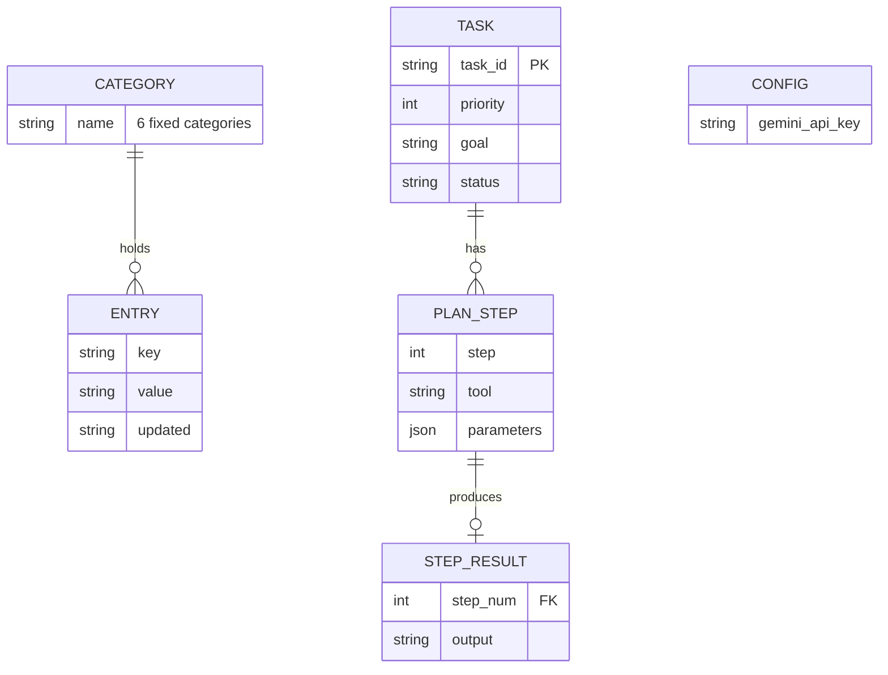

# R.A.Y.A v2.4 — System Design Diagrams (compact)

Trimmed Mermaid diagrams — only the essential nodes, so they render small enough
to paste into the report. Each is also a standalone `.mmd` file in this folder.
All reflect the **actual v2.4 code** (Gemini-only; JSON + in-memory state, no SQLite).

---

## 1. Level 0 Data Flow (Context)

## 2. Level 1 Data Flow

## 3. Use Case

## 4. Activity

## 5. Sequence

## 6. Entity Relationship (real data model — no SQLite)

