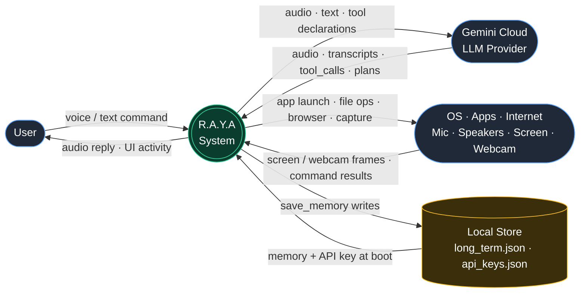
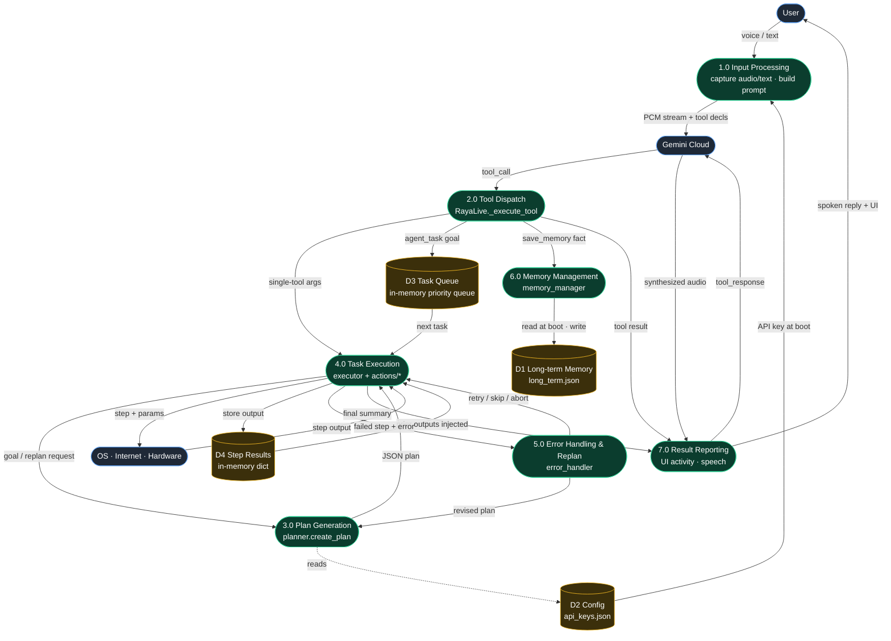
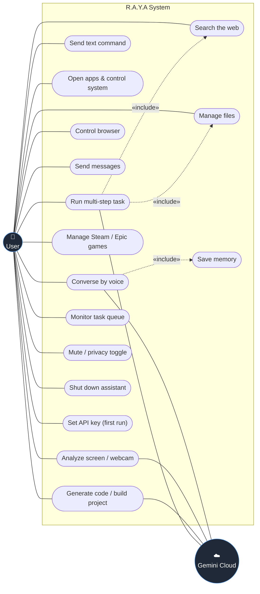
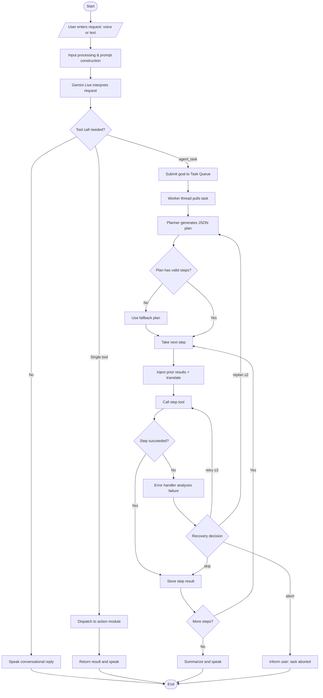
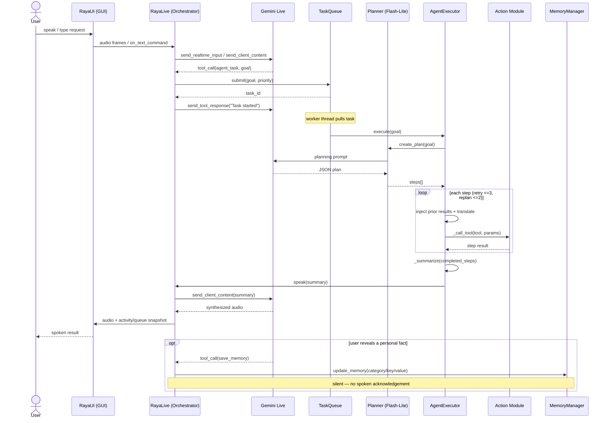
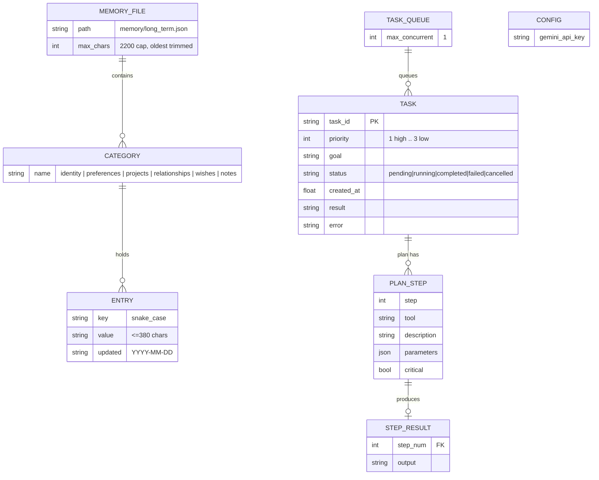

# R.A.Y.A v2.4 — System Design Diagrams

Mermaid sources for the System Design section. Each diagram below is also kept
as a standalone `.mmd` file in this folder. These reflect the **actual v2.4
codebase** (Gemini-only; JSON-file + in-memory persistence), not an idealized
SQLite/OpenRouter design.

| # | Diagram | File |
|---|---|---|
| 1 | Level 0 Data Flow (Context) | `01_dfd_level0.mmd` |
| 2 | Level 1 Data Flow | `02_dfd_level1.mmd` |
| 3 | Use Case | `03_use_case.mmd` |
| 4 | Activity | `04_activity.mmd` |
| 5 | Sequence | `05_sequence.mmd` |
| 6 | Entity Relationship (data model) | `06_er_diagram.mmd` |

---

## 1. Level 0 Data Flow Diagram (Context)

R.A.Y.A as a single process exchanging data with the User, the Gemini Cloud LLM
provider, the host OS/hardware, and its local JSON store.

---

## 2. Level 1 Data Flow Diagram

The single process decomposed into seven sub-processes and four data stores
(D1 long-term memory, D2 config, D3 in-memory task queue, D4 in-memory step
results). Flows mirror the real call graph: dispatch → plan → execute →
error-handle → report.

---

## 3. Use Case Diagram

Primary actor **User**; supporting actor **Gemini Cloud** backs the AI-driven
use cases. `«include»` edges show that conversation can silently save memory and
that a multi-step task draws on web-search and file tools.

---

## 4. Activity Diagram

The complete task lifecycle. Branches at "tool call needed?" into a
conversational reply, a single-tool dispatch, or the agent path with its three
bounded loops (step loop, retry ≤3, replan ≤2).

---

## 5. Sequence Diagram

Message timeline for an `agent_task` request, plus the silent `save_memory`
path. Single-tool requests skip the Queue/Planner/Executor lanes.

---

## 6. Entity Relationship Diagram (actual data model)

> **Important:** R.A.Y.A v2.4 has **no relational/SQLite database**. Persistent
> state is `memory/long_term.json` (six categories, 2200-char cap) and
> `config/api_keys.json`. Tasks and their plan steps live **in memory** in the
> `TaskQueue`/`Task` objects. This ER models those real structures.

